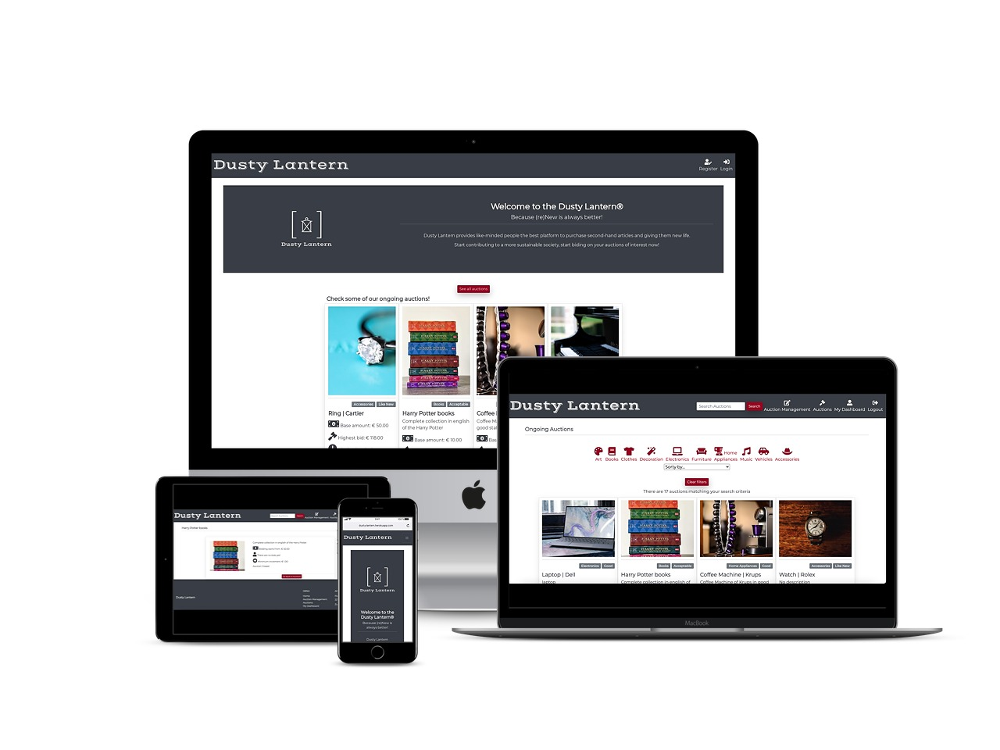
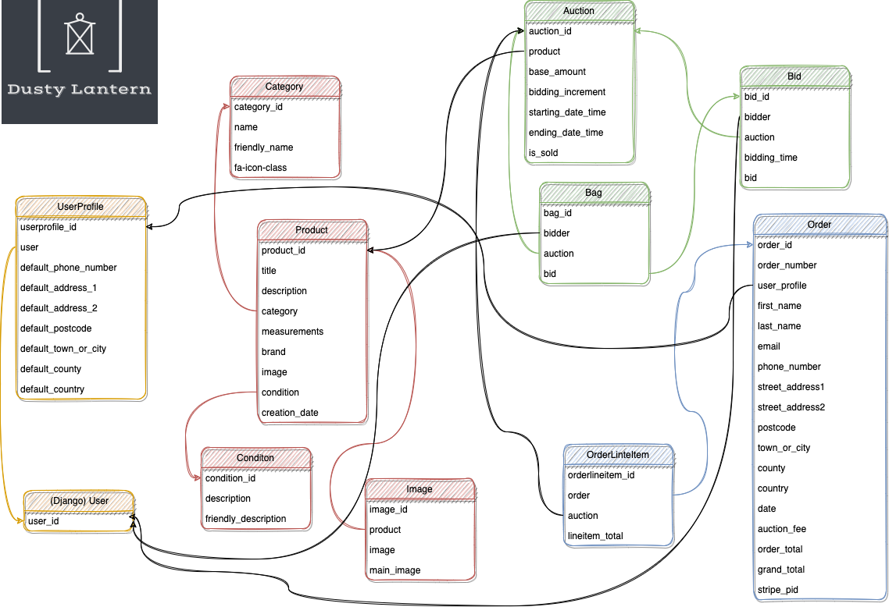

# **DUSTY LANTERN**

---

## **Project Goal** 
***Dusty Lantern*** aims to be a market reference in the auction of second-hand products.

It intends to provide buyers and site owners with an intuitive and appealing platform to trade used belongings.

With sustainability being the key-driver of innovation and the second-hand market increasing substantially during the past years, combining these contexts generates a great opportunity that must be addressed.

With this in mind, the ***Dusty Lantern*** will provide like-minded people the best platform, so they can give second-hand articles a new life and start contributing to a more sustainable society, monetizing old and unused items.

---

## **Table of contents**

1. [UX](#ux)

    1.1 [User Goals and Stories](#user-goals-and-stories)

    1.2 [User Requirements and Expectations](#user-requirements-and-expectations)
    
    1.3 [Site Owners Goals](#site-owners-goals)
    
    1.4 [Design Choices](#design-choices)

2. [Wireframes and DB structure](#wireframes-and-db-structure)
3. [Features](#features)
 
    3.1 [Existing Features](#existing-features)
 
    3.2 [Future Features](#future-features)

4. [Languages, Libraries, Frameworks and Tools](#languages-libraries-frameworks-and-tools)
 
    4.1 [Languages](#languages)
 
    4.2 [Libraries and payment system](#libraries-and-payment-system)
 
    4.3 [Frameworks and Databases](#frameworks-and-databases)
 
    4.4 [Tools](#tools)

5. [Testing and Debugging](#testing-and-debugging)
 
6. [Deployment](#deployment)

7. [Credits and Acknowledgments](#credits-and-acknowledgments)
 
    7.1 [Credits](#credits)
 
    7.2 [Acknowledgments](#acknowledgments)

---

## **UX**

---
[[Back to top]](#table-of-contents)

### **User Goals and Stories**
#### **Goals**

* The homepage must be clear, intuitive and self-explanatory about the purpose of the website
* The platform must be attractive and entice users to participate in the auctions
* The entire website must be fully responsive on every device
* The website must give the user the ability to bid on second-hand articles
* The platform must display auctions categorised

#### **Stories**

As a user:

1. I want to see second-hand articles of my interest
1. I want to place bids on auctions of my interest
1. I want to have a good overview of the ongoing auctions
1. I want to have a full overview of how much I will pay for the won auction in the checkout
1. I want to see my outstanding auctions
1. I want to see how long until the auctions start/finish
1. I want to see my history of won auctions

As a site owner:

1. I want to add products to auctions
1. I want to delete/edit auctions created 
1. I want to follow my auctions bids live
1. I want to have an overview of the items sold
1. I want to receive my payments via a secure platform

[[Back to top]](#table-of-contents)

### **User Requirements and Expectations**
#### **Requirements**

* Easy and intuitive navigation system across pages through a navbar
* Efficient way of finding auctions of interest
* Check my auctions history
* Contact information easy to find

#### **Expectations**

* Strong connections with the platform with via a welcoming landing page
* Links to external pages must open in a new browser tab
* Navigation system must be working properly
* When user places a bid and when auction is finished, the user must receive a confirmation email if it won the auction
* For the auctions won, I want to have the immediate option of proceeding with the payment of the item
* As a buyer, I want to have a clear overview of the total cost of the item to purchase, including any additional fees
* A transparent transaction between the buyer and site owners with a payment platform as an intermediate for a safer transaction

[[Back to top]](#table-of-contents)

### **Site Owners Goals**

1. Monetize the auction website by collecting a percentage fee from all the auctions [Stripe](https://stripe.com/ "Stripe")
1. Promote the auction platform to captivate new users
1. Full overview of all the ongoing and finished auctions
1. Possibility of adding items for sale according to my own requirements (date, base amount, level of bid increments, etc.)

[[Back to top]](#table-of-contents)

### **Design Choices**
#### Fonts

#### Icons

Throughout out the website, I will be using icons provided by [FontAwesome](https://fontawesome.com/ "FontAwesome").

The icons used are self-explanatory and aid the navigation of the user, bringing an intuitive imagery to the website.

#### Colors

While creating this color scheme, I have used the [Contrast-Checker](https://coolors.co/contrast-checker "Contrast Checker") tool to assure a good readability across the website and decide between different color-pairings to be used in the apps.

|Text color  	|Background color  	|Result   	|
|---	        |---	            |---	    |
|#393E46|#EEEEEE|Very good|
|~~#393E46~~|~~#9A031E~~|~~Very poor~~|
|#EEEEEE|#393E46|Very good|
|#EEEEEE|#9A031E|Very good|
|~~#9A031E~~|~~#393E46~~|~~Very poor~~|
|#9A031E|#EEEEEE|Very good|

[[Back to top]](#table-of-contents)

#### **Structure**

The structure of the Dusty Lantern auction website will devided into 7 main sections:

##### **Landing Page**

Regardless of the user being authenticated or not, this page will display a small introduction of the ***Dusty Lantern***, with an appealing design to make the user feel comfortable navigating throughout the platform. 

It will display the current most popular ongoing auctions in order to captivate and engage the user to register/sign in. It will be accompanied by a button for this purpose, if the user is not logged in or a "See all auctions" if it is.

#### **Auctions**

The auctions page is intended to list all the ongoing/future auctions. It will only be available to the user if it is logged in as a buyer (logged in as seller will not display the page to the user).

This page will be powered by a search bar and filter system in order to aid the navigation of the user in finding the desired auction to participate in.

Moreover, the auctions page will have the watchlist functionality in order for the user to follow closely on the auctions of interest. 

#### **Auction Details / Bidding**

The bidding page will maintain the basic structure of the auctions page but will enable the user to place bids on the selected auctions. 

The auctions cards will have an intuitive 'place bid' system where the buyer can place the bid, incrementing the previous highest bid by the amount selected by the seller as the increment for the auction.

#### **Create/Edit auctions/products pages (exclusively for the site owners)**

As the seller, the site owners will have, through dedicated pages powered by corresponding forms, the option to create/edit an auction and the corresponding article in the database.

The form will give the site owners the following options in order to promote the item:

**Form 1: Product**
1. Title
1. Description
1. Category
1. Measurements
1. Brand
1. Condition
1. Image
1. Creation date

**Form 2: Auction**
1. Product
1. Base amount
1. Increment level
1. Start date & time
1. End date & time
1. "Is sold" checkbox

#### **User's Dashboard / Checkout**

The user's dashboard will be the page resuming the actions taken by the user across the other pages.

As a buyer, the page will display the won auctions, the corresponding payment status and the default delivery info.

For the checkout, instead of targeting a session bag like in the BoutiqueAdo project, the checkout uses the database to obtain the highest bidder for a given auction. When the auction closes, it will be automatically added to the user's pending payment orders. Therefore, when the user is ready to pay for the won auctions, he can proceed to the payment via the personal dashboard.

#### **Auction Management**

As a site owner, this page will display at first glance the auctions created, together with other CTA buttons.

The auctions will be displayed in a table giving the user a friendly way to display all the auction fields.

The same goes for the products management page, that will be "embedded" as part of the Auction Management page.

Depending on if the site owner is visualizing auctions or products, it will have the corresponding buttons/links to the add/edit/delete functionalities, allowing the site owner to manage the auctions products in a more appealing way rather than the Django Admin. 

#### **Payment**

The payment page will be powered by [Stripe](https://stripe.com/ "Stripe"): **Stripe Connect**.

At this stage, the user will be displayed a short overview of the auction to be paid (Highest Bid + Auction Fee). The auction fee will be a variable percentage, depending on the base amount of the order total.

This system will allow the auction payment directly from the buyer to the seller, discounting the auction fee, transferring it straight to the site owner's account.

Nonetheless, if you interact with the platform as a seller, you will have to proceed with the verification of your [Stripe](https://stripe.com/ "Stripe") Connect Account in order to comply with [Stripe](https://stripe.com/ "Stripe") safety procedures. This step can be seen as tedious, especially if your intention is to list an auction of a small amount.

On the other hand, it provides the buyer and the site owner with an extra security feature, generating extra confidence in the auction platform usage.

[[Back to top]](#table-of-contents)

---

## **Wireframes and DB Structure**
[[Back to top]](#table-of-contents)

### **Wireframes**

[Small devices](wireframes/small-devices.png)

[Medium Devices](wireframes/medium-devices.png)

[Large devices](wireframes/large-devices.png)

### **DB Structure**
 

[[Back to top]](#table-of-contents)

---

## **Features**

[[Back to top]](#table-of-contents)

### **Existing Features**

* Sign In and Registration functionalities by Django allauth package
* Search engine and filtering so user can refine the search for a specific product/auction
* Bidding system that allows the buyer to increment the current highest bid for any given auction
* Possibility for the site owner to create auctions/products in the database without being the admin
* Follow-up on payables according to payment status

[[Back to top]](#table-of-contents)

### **Future Features**

* Courier's APIs in order to automatically generate a shipping label to the seller and send the tracking number to the auction winner
* Auction watchlist so user can follow-up closely auctions of interest
* Share a specific auction on social networks
* Auction suggestion based on previous search results / watchlist
* When an auction is about to close (< 1 min) and a user places a bid, the counter shall reset the countdown to 1 min again, in order to motivate last minute bids.
* In case the ongoing auctions list becomes to big, I will include a pagination system ordered by end date time first, in order to improve the UX.
* Customized Error handling 
* Send email to user when auction closes informing if he/she won the auction or if he/she was overbid 

[[Back to top]](#table-of-contents)

---

## **Languages, Libraries, Frameworks and Tools**

[[Back to top]](#table-of-contents)

### **Languages**
* [HTML](https://www.w3.org/MarkUp/1995-archive/html-spec.html "HTML")
* [CSS](https://www.w3.org/Style/CSS/Overview.en.html "CSS")
* [Javascript](https://developer.mozilla.org/en-US/docs/Web/JavaScript "Javascript")
* [Python](https://www.python.org/ "Python")

[[Back to top]](#table-of-contents)

### **Libraries and payment system**
* [jQuery](https://jquery.com/ "jQuery")
* [FontAwesome](https://fontawesome.com/ "FontAwesome")
* [Google Fonts](https://fonts.google.com/ "Google Fonts")
* [Unsplash](https://unsplash.com/ "Unsplash")
* [Bootstrap](https://getbootstrap.com/ "Bootstrap")
* [Stripe](https://stripe.com/ "Stripe - Payment system")

[[Back to top]](#table-of-contents)

### **Frameworks and Databases**
* [DJango](https://www.djangoproject.com/ "Django")

[[Back to top]](#table-of-contents)

### **Tools**
* [Git](https://git-scm.com/ "Git")
* [Gitpod](https://gitpod.io/ "Gitpod")
* [Balsamiq](https://balsamiq.com/ "Balsamiq")
* [Microsoft Excel](https://www.microsoft.com/en-us/microsoft-365/excel "Excel")
* [Coolors](https://coolors.co/ "Coolors")
* [Contrast-Checker](https://coolors.co/contrast-checker "Contrast Checker")
* [Free Logo Design](https://www.freelogodesign.org "Free Logo Design")
* [Font Joy](https://fontjoy.com/ "Font Joy")
* [Lorem Ipsum Generator](https://loremipsum.io/ "Lorem Ipsum Generator")
* [Draw.io](https://draw.io/ "Draw.io")
* [TinyPNG](https://tinypng.com/ "Tiny PNG")
* [Favicon](https://favicon.io/favicon-converter/ "Favcicon")
* [RandomKeygen](https://randomkeygen.com/ "RandomKeygen")
* [Smartmockups](https://smartmockups.com/ "Smartmockup")
* [W3C-Markup-validation](https://validator.w3.org/ "Markup Validator")
* [W3C-Jigsaw](https://jigsaw.w3.org/css-validator/ "Jigsaw Validator")
* [W3C-Spell Checker](https://www.w3.org/2002/01/spellchecker "Spell Checker")
* [Google-Lightouse](https://developers.google.com/web/tools/lighthouse "Google Lighthouse")
* [JSHint](https://jshint.com/ "JSHint")

[[Back to top]](#table-of-contents)

---

## **Testing and Debugging**

Testing of this site can be found [here](https://github.com/arturmpinho/Dusty-Lantern/blob/master/testing.md).

Bugs encountered while testing can be found [here](https://github.com/arturmpinho/Dusty-Lantern/blob/master/bugs.md).

[[Back to top]](#table-of-contents)

---

## **Deployment**

More information about the local deployment as well as deployment on Heroku can be found [here](https://github.com/arturmpinho/Dusty-Lantern/blob/master/deployment.md).

[[Back to top]](#table-of-contents)

---

## **Credits and Acknowledgments**

[[Back to top]](#table-of-contents)

### **Credits**
* All software and applications used to create this website are mentioned above in section [Languages Libraries Frameworks and Tools](#languages-libraries-frameworks and-tools).
* [MDN WebDocs](https://developer.mozilla.org/ "MDN WebDocs")

#### **Media**
* You can find all the images sources through the Unslplash collection prepared [here](https://unsplash.com/collections/cf1_UHDmb8c/dusty-lantern/aba2b966f9b41ed3481bedf0f8f5174e "Unsplash").

### **Acknowledgments**

To [Stackoverflow](https://stackoverflow.com/) community and to [W3Schools](https://www.w3schools.com/) for all the content made publicly available.

To [David Walsh](https://davidwalsh.name/always-show-arrows-for-number-input) for your sharing your knowledge.

Thank you as well to the creator(s) of the [Datatables CDN](https://cdn.datatables.net/). This cdn has been a big help for the auctions management section.

To my mentor, Anna_Villanueva, for all the inputs and guidance throughout this project.

To my friends and family that took time to test the website and for their valuable recommendations and insights.

A special thanks to Anouk, for all the support and additional guidance during the development of this project.

[[Back to top]](#table-of-contents)