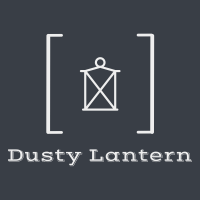

# **DUSTY LANTERN**

---

## **Project Goal** 
***Dusty Lantern*** aims to be the market reference in the auction of second-hand products/belongings.

It intends to provide buyers and sellers with an intuitive and appealing platform to trade their used belongings.

With sustainability being the key-driver of innovation and the second-hand market increasing substantially during the past years, combining both contexts generates a great opportunity that must be addressed.

With this in mind the ***Dusty Lantern*** will provide like-minded people the best platform so they can give second-hand products/belongings a new life and start contributing to a more sustainable society, monetizing their own old and unused items.

---

## **Table of contents**

1. [UX](#ux)

    1.1 [User Goals and Stories](#user-goals-and-stories)

    1.2 [User Requirements and Expectations](#user-requirements-and-expectations)
    
    1.3 [Site Owners Goals](#company-goals)
    
    1.4 [Design Choices](#design-choices)

2. [Wireframes and DB structure](#wireframes-and-DB-structure)
3. [Features](#features)
 
    3.1 [Existing Features](#existing-features)
 
    3.2 [Future Features](#future-features)

4. [Languages, Libraries, Frameworks and Tools](#languages-libraries-frameworks-and-tools)
 
    4.1 [Languages](#languages)
 
    4.2 [Libraries](#libraries)
 
    4.3 [Frameworks and Databases](#frameworks-and-databases)
 
    4.4 [Tools](#tools)

5. [Testing and Debugging](#testing-and-debugging)
 
6. [Deployment](#deployment)

7. [Credits and Acknowledgments](#credits-and-acknowledgments)
 
    7.1 [Credits](#credits)
 
    7.2 [Acknowledgments](#acknowledgments)

---

## **UX**

---
[[Back to top]](#table-of-contents)

### **User Goals and Stories**
#### **Goals**

* The homepage must be clear, intuitive and self-explanatory about the purpose of the marketplace
* The marketplace must be attractive and entice user to participate in the auctions
* The entire website must be fully responsive on every device
* The website must give the user the ability to bid/sell second-hand articles
* The marketplace must display auctions categorised

#### **Stories**
User stories are divided into buyer/seller as the user will have the option to choose which status he wants to interact with the platform with.

Therefore,

As a **buyer**:

1. I want to see second-hand articles of my interest
1. I want to place bids on auctions of my interest
1. I want to have a a good overview of the most poplar auctions
1. I want to add to a watchlist the auctions I want to follow/participate
1. I want to have a full overview of how much I will pay for the won auction
1. I want to see my outstanding open balance
1. I want to see when the auctions will start
1. I want to see how long until the auction closes
1. I want to see my history of won auctions

As a **seller**:

1. I want to add items to auctions
1. I want to delete auctions created if these did not start or up to 24hrs before auction starting date & time
1. I want to edit auctions created if these did not start or up to 24hrs before auction starting date & time
1. I want to see my outstanding receivables
1. I want to follow my auctions bids live
1. I want to have an overview of my items sold
1. I want to receive my payments via a secure platform

[[Back to top]](#table-of-contents)

### **User Requirements and Expectations**
#### **Requirements**

* Easy and intuitive navigation system across pages through a navbar
* Efficient way of finding auctions of interest as a buyer
* Possibility of adding items for sale according to my own requirements (date, base amount, level of bid increments, etc.)
* Check my auctions history
* Easy switch between my seller/buyer profiles
* Contact information easy to find

#### **Expectations**

* Strong connections with the platform with via a welcoming landing page
* Links to external pages must open in a new browser tab
* Navigation system must be working properly
* When auction is finished, as a buyer, I want to receive a confirmation email if I won the auction
* For the auctions won as a buyer, I want to have the immeadiate option of proceeding with the payment of the item
* As a buyer I want to have a clear overview of the total cost of the purchase item, including any additional fees
* As a seller, a transparent transaction between the buyer and me with the platform as an intermediate for a safer transaction

[[Back to top]](#table-of-contents)

### **Site Owners Goals**

1. Monetize the auction marketplace by collecting a percentage fee from the seller/buyer via STRIPE
1. Promote the auction platform to captivate new users
1. Full overview of all the ongoing and finished auctions

[[Back to top]](#table-of-contents)

### **Design Choices**
#### Fonts

#### Icons

Throughout out the website, I will be using icons provided by [FontAwesome](https://fontawesome.com/ "FontAwesome").

The icons used are self-explanatory and aid the navigation of the user, bringing an intuitive imagery to the website.

#### Colors

#393E46: 

#EEEEEE: 

#9A031E: 

While creating this color scheme, I have used the [Contrast-Checker](https://coolors.co/contrast-checker "Contrast Checker") tool to assure a good readability across the website and decide between different color-pairings to be used in the apps.

|Text color  	|Background color  	|Result   	|
|---	        |---	            |---	    |
|#393E46|#EEEEEE|Very good|
|~~#393E46~~|~~#9A031E~~|~~Very poor~~|
|#EEEEEE|#393E46|Very good|
|#EEEEEE|#9A031E|Very good|
|~~#9A031E~~|~~#393E46~~|~~Very poor~~|
|#9A031E|#EEEEEE|Very good|

[[Back to top]](#table-of-contents)

#### Structure

***Here comes the structure intro***

##### Page/Component/Feature

##### Page/Component/Feature

[[Back to top]](#table-of-contents)

---

## **Wireframes and DB Structure**
[[Back to top]](#table-of-contents)

### **Wireframes**

[Small devices](wireframes/small-devices.png)

[Medium Devices](wireframes/medium-devices.png)

[Large devices](wireframes/large-devices.png)

### **DB Structure**
 

[[Back to top]](#table-of-contents)

---

## **Features**

[[Back to top]](#table-of-contents)

### **Existing Features**

* 

[[Back to top]](#table-of-contents)

### **Future Features**

* 

[[Back to top]](#table-of-contents)

---

## **Languages, Libraries, Frameworks and Tools**

[[Back to top]](#table-of-contents)

### **Languages**
* [HTML](https://www.w3.org/MarkUp/1995-archive/html-spec.html "HTML")
* [CSS](https://www.w3.org/Style/CSS/Overview.en.html "CSS")
* [Javascript](https://developer.mozilla.org/en-US/docs/Web/JavaScript "Javascript")
* [Python](https://www.python.org/ "Python")

[[Back to top]](#table-of-contents)

### **Libraries**
* [jQuery](https://jquery.com/ "jQuery")
* [FontAwesome](https://fontawesome.com/ "FontAwesome")
* [Google Fonts](https://fonts.google.com/ "Google Fonts")
* [Unsplash](https://unsplash.com/ "Unsplash")

[[Back to top]](#table-of-contents)

### **Frameworks and Databases**
* [Bootstrap](https://getbootstrap.com/ "Bootstrap")
* [DJango](https://www.djangoproject.com/ "Django")

[[Back to top]](#table-of-contents)

### **Tools**
* [Git](https://git-scm.com/ "Git")
* [Gitpod](https://gitpod.io/ "Gitpod")
* [Balsamiq](https://balsamiq.com/ "Balsamiq")
* [Microsoft Excel](https://www.microsoft.com/en-us/microsoft-365/excel "Excel")
* [Coolors](https://coolors.co/ "Coolors")
* [Contrast-Checker](https://coolors.co/contrast-checker "Contrast Checker")
* [Free Logo Design](https://www.freelogodesign.org "Free Logo Design")
* [Font Joy](https://fontjoy.com/ "Font Joy")
* [Lorem Ipsum Generator](https://loremipsum.io/ "Lorem Ipsum Generator")
* [TinyPNG](https://tinypng.com/ "Tiny PNG")
* [Favicon](https://favicon.io/favicon-converter/ "Favcicon")
* [RandomKeygen](https://randomkeygen.com/ "RandomKeygen")
* [Techsini](http://techsini.com/multi-mockup/ "Techsini")
* [W3C-Markup-validation](https://validator.w3.org/ "Markup Validator")
* [W3C-Jigsaw](https://jigsaw.w3.org/css-validator/ "Jigsaw Validator")
* [W3C-Spell Checker](https://www.w3.org/2002/01/spellchecker "Spell Checker")
* [Google-Lightouse](https://developers.google.com/web/tools/lighthouse "Google Lighthouse")
* [JSHint](https://jshint.com/ "JSHint")

[[Back to top]](#table-of-contents)

---

## **Testing and Debugging**

[[Back to top]](#table-of-contents)

---

[[Back to top]](#table-of-contents)

### **Debugging**

[[Back to top]](#table-of-contents)

---

## **Deployment**

### Local Deployment

    
### To deploy your project on Heroku, use the following steps: 

[[Back to top]](#table-of-contents)

---

## **Credits and Acknowledgments**

[[Back to top]](#table-of-contents)

### **Credits**
* All software and applications used to create this website are mentioned above in section [Languages Libraries Frameworks and Tools](#languages-libraries-frameworks and-tools).
* [MDN WebDocs](https://developer.mozilla.org/ "MDN WebDocs")

#### **Media**
* 

#### **Content**
* 

[[Back to top]](#table-of-contents)

### **Acknowledgments**

[[Back to top]](#table-of-contents)