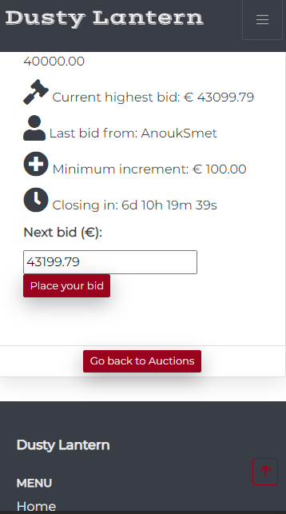

# Bugs

## Responsiveness

### Footer is not fixed to the bottom
TBF

### Country field select-box arrows are not being displayed

TBF

### Increment and decrement input field arrows not being displayed in mobiles
During the testing phase, I have been alerted to the fact that the input field where you define the bid amount that you want to place was not displaying the increment/decrement arrows.

This bug is caused due to browser compatibility, which differ widely in between them. As a fix, I have opted out to remove the non-editable restriction, allowing the user to type the amount of the next bid and by doing the form validation defining the min, max and step attributes levels with the corresponding values from the DB.

Nonetheless, in the future, I want to tackle this form of form validation as per warning of the [MDN WebDocs](https://developer.mozilla.org/en-US/docs/Web/HTML/Element/input/number "Mozilla Developer Network"), doing it so on the server-side due to security reasons.

## Functionality

### Countdown timer
As part of an additional feature for the project and extreamly important requirement for any auction plaftorm, I have built a countdowntimer in order to establish if an auction is ongoing or currently closed.

Depsite the ease of reasoning behind, I have come across several challenges when dealing with time formats.

Firstly, I was confrontated with the weird difference when displaying the minutes in the countdown. 
After going through several attemps to debug my functionality in Javascript, I have realized that the difference, in the end, was being generated due to a typo in the Django datetime format in the auctions/auction_detail templates. Where I was using "|date:"Y-m-d H:**m**:s", I add to use |date:"Y-m-d H:**i**:s".

After this issue was corrected, and following the attempt to refresh the page when the countdowntimer reaches **0**, an additional issue cama along. Due to the milliseconds format used in the javascript, the timer was never exactly **0**. After researching for a long time in the internet, I have not found any fix for this peculiarity. Therefore, I have built the following workaround:

    if (timeleft < 1500 && timeleft > -5000) {
      timer = 0
    } 

This piece of logic allows the timer to be exaclty **0** for around 6,5 seconds, attempting the refresh at least for 5 times, ensuring that the "place bid" section will be removed automatically from the auction when this closes.

I understand that this is not bullet-proof but a workaround instead and that this issue must be addressed in the future in order to gurantee 99,9% that anyone can place a bid after the auction closes, as well-functioning countdowntimer is a core piece in any auctions platform.

### Timezone difference
Another time related bug that I have fixed was when creating an auction in my current timezone.

As per default, Django as the timezone set to 'UTC' ans 'USE_TZ' set to 'False'. Nontheless, when I was creating an auction in my timezone (Europe/Amsterdam), it was being created with the server time, originating a time difference between the input time and the actual time in the DB.

To tackle this issue, I have set the time zone settings as such:

    TIME_ZONE = 'Europe/Amsterdam'
    USE_TZ = True

### Add to cart functionality
When bulding the "add to cart" functionality, the first approach was to do it with javascript, as per below shot:

* Add to cart via JS

        // Add to cart functionality when auction closes

        function addToCart() {
        var auctionId = document.getElementById('auction_id').value;
        var csrfToken = $('input[name="csrfmiddlewaretoken"]').val();
        var postData = {
            "auction_id": auctionId,
            'csrfmiddlewaretoken': csrfToken,
        }

        var url = `${auctionId}/add_to_cart`
        $.post(url, postData).done(function () {            
            .then(function(result) {
            });
        }).fail(function (e) {
            console.log(e)
        })
        };

Nontheless, after the functionality was up and running, only then I realized that this option would only be able to be triggered if the user is of course with its browser open. Of course thta is not realistic due to the type os auctions present.

Therefore, my second approach was to implement a background task to run this function (based on [Django Background Tasks](https://django-background-tasks.readthedocs.io/en/latest/ "Django Background Tasks"), [Django Compat](https://github.com/arteria/django-compat "Django Compat") and/or [Django Scheduler](https://github.com/llazzaro/django-scheduler "Django Scheduler")) asynchronous with the database and triggered by the previous mentioned countdowntimer. Unfortunately, this was not possible with my current knowledge.

In the end, I came to conclude that the easier approach was merely to start by adding a boolean fild in the auctions model, defining if the auction was sold or not.

The second step was to create the following functionality in Python:

    @login_required
    def add_to_cart(request, auction_id):
        """ Add auction to cart"""

        auction = get_object_or_404(Auction, pk=auction_id)
        bids = Bid.objects.filter(auction=auction.id)
        if bids:
            current_highest_bid = bids.order_by('-bidding_time')[0]
            bidder = current_highest_bid.bidder

            # Ensure there is no other bag for this user to ensure proceeding
            # checkout with 1 auction only
            expired_bag = Bag.objects.filter(bidder=current_highest_bid.bidder)
            if expired_bag:
                for item in expired_bag:
                    item.delete()

            bag = Bag(
                auction=auction,
                bid=current_highest_bid,
                bidder=bidder
            )
            bag.save()

            return redirect(reverse('checkout'))

This function has the capability of, when the user navigates to the profile page, filtering the auctions where he/she was the highest bidder, checking if there is already an existing bag (and deleting it if necessary) and creating the bag.

When this function is called the user will be displayed all the auctions for which he/she had the highest bid and due to the boolean field "is_sold" displaying only the auctions that are pending payment.

Afterwards, this bag is converted into a session bag when the user proceeds with the checkout.

### Countdown timer is not being displayed properly

One of the biggest challenges in a programming environment is without any doubt, working with datetime formats, and building an application where one of the core functionalities is based on this is no less that a great challenge.

Unfortunately, I did not realized the true impact of this until the moment that I started the testing phase. It was then when I realized that the countdowntimer was displaying in Apple's devices the following string: NaNd NaNh NaNm NaNs.

While I thought it was mainly an issue of "devices/browsers", the true impact of this bug was extremely bigger than that.

This was in fact originating that some auctions where being displayed as "Ongoing" whilst they were "Closed" across devices.

Therefore, after intense research and realizing that this bug was indeed a worldwide issue, I have read very carefully the following documentation from [MDN WebDocs](https://developer.mozilla.org/en-US/docs/Web/JavaScript/Reference/Global_Objects/Date/parse "Mozilla Developer Network") to fully understand how datetime formating is being comprehended by the browsers, leading me to reconvert the datetime variables type for the countdowntimer to be fully compatible in every device/browser, as per shot below: 

    let start_date_time = new Date(document.getElementsByClassName('start_date_time').item(i).textContent);
    let end_date_time = new Date(document.getElementsByClassName('end_date_time').item(i).textContent);
    let now = Date.now()

    let start_date_time = Date.parse(`${document.getElementsByClassName('start_date_time').item(i).textContent.trim().replace(/ /g,"T")}Z`);
    let end_date_time = Date.parse(`${document.getElementsByClassName('end_date_time').item(i).textContent.trim().replace(/ /g,"T")}Z`);
    let now = Date.now()
    

### Duplicate order via the webhookhandler
During the payment I have realized that some orders were being duplicate: onw created via the DB and another via the webhookhandler.

Therefore, after debugging the code, I conculded that the webhookhandler was creating a new order as it was not finding that exact same purchase in the DB, and the issue was the name split, meanign that if the user presented 2 first names or 2 last names, the webhook could never find the match as the names were different than the ones created in the DB.

Therefore, I removed the First and Last Names as a comparison between the 2.

Being all the rest exactly the same, the order is not being created in a duplicate manner.

### Start/End date times are not being populated on editing the auctions
TBF

### Uploaded Images are not being recognized by the editing product form 
TBF

### Unselect checkbox to save user's info during checkout is not preventing overwriting the user data in the DB.

This bug was a typical case of languages differences.

    JS:
    var saveInfo = Boolean($('#id-save-info:checked').val())

    Python:
            username = intent.metadata.username
        if username != 'AnonymousUser':
            user_profile = UserProfile.objects.get(user__username=username)
            cc
                user_profile.default_phone_number = shipping_details.phone
                user_profile.default_country = shipping_details.address.country
                user_profile.default_postcode = (shipping_details.
                                                 address.postal_code)
                user_profile.default_town_or_city = (shipping_details.
                                                     address.city)
                user_profile.default_street_address1 = (shipping_details.
                                                        address.line1)
                user_profile.default_street_address2 = (shipping_details.
                                                        address.line2)
                user_profile.default_county = shipping_details.address.state
                user_profile.save()

During the checkout process, the save info checkbox is being automatically "checked" via a Boolean field in JS. This means that when you need to retreive that value (true/false) in python, it won't retreive it capitalized (True/False), leading the function in the webhookhandler not recognizing the JS value. Therefore, the bug fix was to make the following if statement in order to make the user info to update in the DB: 

    if save_info != "false":